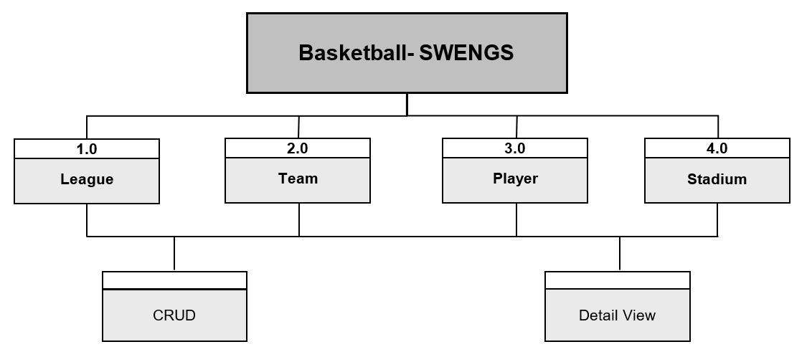

# Basketball SWENGS

This Application was realized as part of a study project of the course "Software Engineering Selective" of the degree program  
"Information Management" at the FH Joanneum Graz. This is the project Folder for the frontend part created by the  
following team members:

* <a href="https://github.com/SuperCari">Cölestin Carina</a>
* <a href="https://github.com/fortmuel15">Fortmüller Vanessa</a>
* <a href="https://github.com/HribernigNikolaus">Hribernig Nikolaus</a>
* <a href="https://github.com/x-qlusive">Plank Patrick</a>

# Table of content

1. [How to set up](#how-to-set-up)
2. [Focus and Description](#projectfocus-and-description)
3. [Project planning](#project-planning) 
4. [Features](#features)
5. [Special Features](#special-features)
6. [Planned Tasks after Kick-off VS. Final Version](#planned-tasks-after-kick-off-vs.-final-version)
7. [Activities](#activities)
7. [Lessons Learned](#lessons-learned)

# How to set up

**Important:**   
* Frontend: Before npm start, go in the sub-directory basketball-app (>cd basketball-app)

## BasketballApp

   This project was generated with [Angular CLI](https://github.com/angular/angular-cli) version 1.5.4.

* ### Development server

    Run `ng serve` for a dev server. Navigate to `http://localhost:4200/`. The app will automatically reload if you change any of the source files.

* ### Code scaffolding
    Run `ng generate component component-name` to generate a new component. You can also use `ng generate directive|pipe|service|class|guard|interface|enum|module`.

* ### Build

    Run `ng build` to build the project. The build artifacts will be stored in the `dist/` directory. Use the `-prod` flag for a production build.

* ### Running unit tests

    Run `ng test` to execute the unit tests via [Karma](https://karma-runner.github.io).

* ### Running end-to-end tests

    Run `ng e2e` to execute the end-to-end tests via [Protractor](http://www.protractortest.org/).

* ### Further help

    To get more help on the Angular CLI use `ng help` or go check out the [Angular CLI README](https://github.com/angular/angular-cli/blob/master/README.md).

# Focus and Description

This Project includes a frontend part as well a backend part. For the Backend we used _Spring Boot_, _JSON_ and _HATEOS_.  
For the Frontend we used _Angular 2_ and _Typescript_, which is a programing language developed and maintained by Microsoft. 

This application is used to create an admin interface for the management of basketball players. You will get an overview of all members of certain basketball  
teams and leagues. For each entity there is a separate menu-view which is displayed in form of cards. In addition, there is a detail view of each card.   
Furthermore, it is shown which team belongs to which stadium (home-stadium) or which player to which team and league etc.   
The dependencies are shown in the ER diagram:

Every Teammember has to implement its own entity:  
   
**Carina - _"League"_**  
**Nikolaus - _"Player"_**  
**Patrick  - _"Team_**  
**Vanessa - _"Stadium"_**  

# Project planning

To see the changes and updates happening in our project we used GitHub as working-platform.   
So it was possible to be up to date all the time and have a focus on the effort. In addition we create  
a Whatsapp Group for daily communication. Furthermore we had regular meetings to discuss the progress  
and work together. The Whiteboard and flipchart were important elements to talk about the project-structure and other details... 
 
 

# Features

• Angular 2  
• CRUD-Application (Create, Read, Update, Delete)  
• RESTful Backend  
• Client  
• Searching for Data via HTTP using Parameters  
• Displaying Data  
• Editing and Validating Data  
• Routing (Navigation between "Pages", actually Components)  
• Subdividing Components (using more Components)  

# Special Features
erweiterte Security durch OATH2 
=> nähere Infos nach Fertigstellung

# Planned Tasks after Kick-off VS. Final Version

## Kick-off:

**Ideas:**   
* Backend as proposed  
* Frontend Pages :  
    * Main  
    * League  
    * Team   
    * Player  
    * Stadium  
* Https keys for backend  
* User login     
    * Guests --> Show  
    * Admin  --> Edit, Create
    
## Final Version:

* RESTful Backend  
* Frontend Pages :  
    * Home  
    * League  
    * Team   
    * Player  
    * Stadium 
    * Impressum 
* Https keys for backend  
* User login     
    * Guests --> Show  
    * Admin  --> Edit, Create 

# Activities

| Carina          	| Vanessa     	    | Niki        	    | Patrick 	        |
| -----------------	| -----------------	| ----------------	| --------------	|
| League - Entity   | Stadium - Entity  | Player - Entity 	| Teams - Entity  	|
| Documentation 	| Design        	| Database       	| Backend           |
| View Component  	| Formulare   	    | Backend           | Support        	|
| Presentation      | Validierung       | Foreign Keys      | Security          |
| HTML / CSS        | HTML / CSS      	| CRUD              | CRUD        	    |
| CRUD              | CRUD         	    | Support    	    | Testdaten         |
| Testdata etc.     | etc.         	    | etc.   	        | etc.     	        |

# Lessons Learned  

* Time Management very hard because of
    * other projects  
    * because team members are part of different groups - so they have different timetables
* to read in new topics – very time-comsuming
* imprecise working – long error diagnostics (typos)

